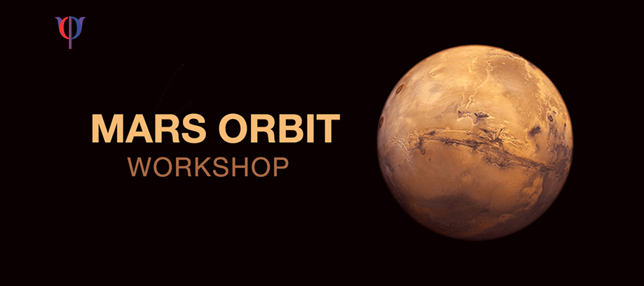

## Introduction

This project contains the material to conduct a workshop recreating Kepler's breakthrough discovery of the elliptical orbit of Mars, intended for a high school audience. The workshop is designed to give the students a deeper undersanding of the physical concepts, along with a flavor of data analytics. 

The approach for this workshop comes from a graduate data-analytics class taught by Professor Rajesh Sundaresan and Professor Ramesh Hariharan at the Indian Institute of Science, Bangalore, India. The Mars Orbit module from this class was adapted for the session, by simplifying and black-boxing the computational approach. This enabled high-school students to understand the conceptual approach, and use the modules they were provided to perform relatively complex computations. This was done during the course of my internship from June - August 2018, under the guidance of Professor Sundaresan and Niheshkumar Rathod, at the Robert Bosch Center for Cyber-Physical Systems, Indian Institute of Science, Bangalore, India.

There are two main parts of the project
- The Jupyter Notebook designed to guide the students through hands-on programming activities.
- The python package that modularises all the need computational and plotting requirement for the workshop.

